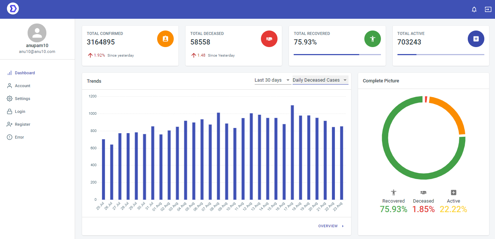

# react_dashboard_covid
Covid tracker Dashboard build using react

<h1>Screenshots REACT COVID TRACKER Dashboard</h1>

<h1>Installation and Setup Instructions</h1>

Installation:

npm install

To Run Test Suite:

npm test

To Start Server:

npm start

To Visit App:

localhost:3000/

