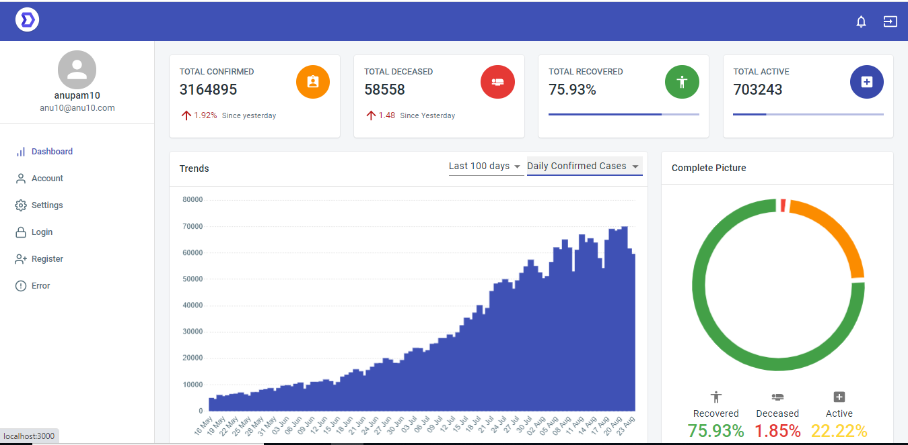

# react_dashboard_covid
Covid tracker Dashboard build using react

<h1>Screenshots REACT COVID TRACKER Dashboard</h1>

<h1>Installation and Setup Instructions</h1>

<h4>Installation:</h4>

npm install

<h4>To Run Test Suite:</h4>

npm test

<h4>To Start Server:</h4>

npm start

<h4>To Visit App:</h4>

localhost:3000/

<h1>To import Test Data to firebase</h1>

 You can get the covid related data freely from 'https://api.covid19india.org/data.json'. For this demo project we are fetching data from firebase. To do so we need to inser the json data in firebase, you can use the below command for same.

Run 'node ./src/importdata_scripts/TimeSeriesDat.js'

